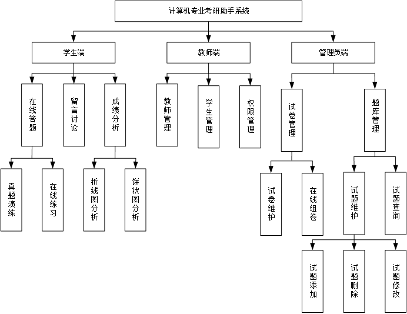

## 开发工具
* 操作系统：Windows 10
* 后端开发平台：Eclipse IDE
* 前端开发平台：Visual Studio Code
* 接口测试工具：Postman
* 前端调试工具：Google Chrome
* 数据库：MySQL 
* 画图工具：Visio

## 技术栈

* SSM框架
* VUE框架

## 相关目录说明

`educationCode`: 为前端源码

`graducation-education-code`: 为后端接口源码

`db_education_platform.sql`：数据库文件

`flowchats`: 一些流程/系统架构图

`result_images`: 部分结果截图

## 总体结构设计

## 系统模块设计

